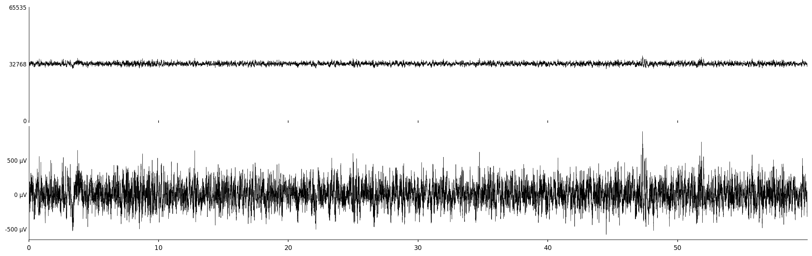

# HALOReader

HALOReader is the host-side C++/Qt GUI application that drives the seizure detection system [v1.0]. It reads neural recordings from Intan RHD files, streams them to an Opal Kelly XEM7310 FPGA running the HALO bitstream, and parses the seizure-start / seizure-end events that come back out. This file provides a formal verification, architecture discussions, and detailed walkthrough of the original codebase.

## 1. Data Input

The Intan RHD2000 amplifier produces binary RHD configurable duration/frequency files at the user prefered location. HALOReader further pools this data from the selected storage location, allowing the Intan DAQ interface remain unchanged. The RHD reader (`rhd_reader.h`) is provided by the oficial website (https://intantech.com/downloads.html?tabSelect=Software) extracts amplifier data as raw 16-bit ADC codes.

### SPI Initialization

The host configures the RHD2000 over SPI before recording begins.

The only register this pipeline depends on is Register 4 to explicitly define how to quantize the bipolar neural signal. The Intan RHX leaves `twoscomp = 0` (offset binary) by default. All register values are stored in the `.rhd` file header and can be easily verified offline.

| bit | encoding |
|:-:|---|
| `0` | 32768 offset |
| `1` | two's complement |

After initialization the chip enters continuous conversion mode, sampling round-robin.

### Offset Correction

`µV = (raw_uint16 − 32768) × 0.195` \
Per [RHD2000 datasheet](https://intantech.com/files/Intan_RHD2000_series_datasheet.pdf) p. 6, Electrical Characteristics table. \
Done on the FPGA.



### RhdData

Unmodified.

```cpp
// rhd_reader.h
struct RhdData {
    // [channel][sample]
    std::vector<std::vector<uint16_t>> amplifier_data;
    double   sample_rate;
    uint32_t num_channels;
    uint32_t num_samples;
};
```

## 2. FPGA Setup

`FpgaProcessor::processData()`

### 2.1 WireIn Endpoint Map

| Address | Signal | Default | Purpose |
|---------|--------|---------|---------|
| `0x00` | `ep00wire[31]` | — | rst |
| `0x01` | `ts_in_lo_w` | random | timestamp seed, lower 32 bits |
| `0x02` | `ts_in_hi_w` | random | timestamp seed, upper 32 bits |
| `0x03` | `threshold_value_w` | 25000 | NEO threshold |
| `0x04` | `window_timeout_w` | 200 | Samples without detection before END event |
| `0x05` | `transition_count_w` | 30 | Consecutive detections to fire START event |

### 2.2 Clock

Shared global `okClk` generated from the OK stub. \
Not asynchronous. Uses FIFOs to process data in packets for USB TX.

```verilog
// First.sv (latch wires on CLK)
always @ (posedge okClk) begin
    reset_ro            <= ep00wire[31];
    threshold_value_ro  <= threshold_value_w  != 32'd0 ? threshold_value_w  : 32'd25000; // set/default
    window_timeout_ro   <= window_timeout_w   != 32'd0 ? window_timeout_w   : 32'd200;   // set/default
    transition_count_ro <= transition_count_w != 32'd0 ? transition_count_w : 32'd30;    // set/default
end
```

### 2.3 Boot Sequence

```cpp
// ------------------------------------------------------------------------
// fpga_processor.cpp
// ------------------------------------------------------------------------
// Initialize FPGA with the bitstream
bool FpgaProcessor::initialize(const std::string& bitfile_path);
// Configure => handle RST => send/receive data => parse output
bool FpgaProcessor::processData(const std::vector<uint16_t>& data_channels, // [ch2_s0, ch2_s1, ...]
                               uint32_t num_channels,                       // 30
                               uint32_t num_samples,                        // 128
                               std::vector<SeizureEvent>& events);          // [[TYPE, CH, TM, S], ...]
// ------------------------------------------------------------------------
// FIFO Input Handler (format chunks one-by-one)
std::vector<std::vector<uint8_t>> FpgaProcessor::generateChunks(
                               const std::vector<uint16_t>& data_channels,  // FIFO I/P Data
                               uint32_t num_channels,                       // 30
                               uint32_t num_samples);                       // 128
// FIFO Output Handler (see Defined Interface below)
void FpgaProcessor::parseEvents(const std::vector<uint8_t>& output_data,    // FIFO O/P Data
                                uint32_t num_channels,                      // 30
                                std::vector<SeizureEvent>& events);         // [[TYPE, CH, TM, S], ...]
```

```cpp
// Seizure Detection
struct SeizureEvent {
    // NOTE: RNS system detect seizure onset.
    // Our pipelines aims to detect seizure regions, but in practice
    // seizure offset cannot be fully evaluated during stimulations.
    enum Type {
        START = 1,  // seizure onset
        END = 2     // seizure offset
    };
    
    Type type;
    uint32_t channel;       // Channel ID (2-31)
    uint32_t timestamp;     // Sample timestamp (milliseconds from start)
    uint64_t sample_index;  // Sample index in the 128 chunk
};
```

## 3. FIFO I/P Packet

Each 16-bit ADC sample is packed into a 32-bit word and sent through the bulk USB PipeIn 0x80.

```cpp
// generateChunks()
uint32_t word32 = (ch << 16) | code16;
//  bits [21:16] = channel_id
//  bits [15:0]  = ADC code    (0-65535, midpoint 32768)
```

The FPGA receives the words and unpacks them one cycle at a time:

```verilog
// First.sv
always @ (posedge okClk) begin
    ...
    if (!in_wait_data_ro) begin
        if (!fifoInEmpty_ro) begin
            fifoInRead_ri   <= 1'b1;
            in_wait_data_ro <= 1'b1;
        end
    end else begin
        dp_data_ro       <= fifoInDataOut_ro[15:0];   // ADC code
        dp_channel_id_ro <= fifoInDataOut_ro[21:16];  // channel_id
        dp_data_valid_ro <= 1'b1;
        in_wait_data_ro  <= 1'b0;
    end
end
```

## 4. Seizure Detection

The datapath is a 3-stage synchronous pipeline clocked at 100.8 MHz (`okClk`). It processes one sample per two cycles and maintains independent state for each of the 32 channels.

```verilog
// datapath.sv
module datapath (
    input  wire        clk,
    input  wire        rst_n,
    input  wire [31:0] threshold_value,
    input  wire [31:0] window_timeout,
    input  wire [31:0] transition_count,
    input  wire        data_valid,
    input  wire [15:0] data,          // 16-bit ADC code
    input  wire [5:0]  channel_id,    // 0-31

    output reg         output_valid,
    output reg [31:0]  output_timestamp,
    output reg         output_event,  // START/END
    output reg [5:0]   output_channel
);
```

### 4.1 Per-Channel State

Each of the 32 channels carries its own independent context:

```verilog
gating_state_t  channel_state              [0:31];          // NORMAL / SEIZURE
logic [15:0]    channel_continuous_counter [0:31];          // timeout counter
logic [7:0]     channel_detection_counter  [0:31];          // onset counter
logic [31:0]    channel_timestamp          [0:31];          // sample count
logic [1:0]     channel_history_count      [0:31];          // 0-3 warmup
logic [15:0]    channel_sample_history     [0:31][0:2];     // sliding NEO window
```

### 4.2 Stage 0: History Collection

A three-sample sliding window is maintained per channel. NEO computation cannot start until 3 samples are collected.

```verilog
// Slide window: prev <= curr <= next <= new
channel_sample_history[channel_id][0] <= channel_sample_history[channel_id][1];
channel_sample_history[channel_id][1] <= channel_sample_history[channel_id][2];
channel_sample_history[channel_id][2] <= data;

if (history_count >= 2'd3) begin
    curr_sq_pipe       <= curr_sq;      // assign curr_sq   = x_curr_signed * x_curr_signed;
    neigh_mul_pipe     <= neigh_mul;    // assign neigh_mul = x_prev_signed * x_next_signed;
    channel_id_sq_pipe <= channel_id;   // for each channel
    data_valid_sq_pipe <= 1'b1;         // ensure 3 samples in a row
end
```

Once ready, stage 0 handles always_comb block to prepare values for NEO. \
IMPORTANT: Apply offset.

```verilog
logic signed [33:0] curr_sq, neigh_mul;
logic signed [33:0] curr_sq_pipe, neigh_mul_pipe;
```

```verilog
assign x_prev_signed = $signed({1'b0, sample_history[0]}) - 17'd32768;
assign x_curr_signed = $signed({1'b0, sample_history[1]}) - 17'd32768;
assign x_next_signed = $signed({1'b0, sample_history[2]}) - 17'd32768;

assign curr_sq   = x_curr_signed * x_curr_signed;  // 17×17 => 34 bits signed
assign neigh_mul = x_prev_signed * x_next_signed;  // 17×17 => 34 bits signed
```

Correctness: 16-bit ADC => 17-bit signed after centering (range 32767) => 34-bit signed product (range approx 2^{30}). No overflow is possible here with Intan data.

### 4.3 Stage 1: NEO Computation

The Nonlinear Energy Operator proposed by Professor Zaveri computes instantaneous signal energy in a way that amplifies high-frequency bursts characteristic of seizure activity.

```
ψ[n] = x[n]² − x[n−1] × x[n+1]
```

Stage 1 resolves the subtraction and absolute value:

```verilog
logic signed [33:0] neo_val;       // 34-bit signed
logic        [33:0] neo_abs;       // 34-bit unsigned
```
```verilog
// stage 1: +2 cycles (always_ff, fires when valid)
neo_val     <= curr_sq_pipe - neigh_mul_pipe;
neo_abs     <= neo_val[33] ? (~neo_val + 1'b1) : neo_val;
detected    <= (neo_abs > threshold_value);
```

### 4.4 Stage 2: Gating State Machine

Each channel's FSM tracks whether ongoing NEO threshold crossings constitute a seizure onset or offset.

**NORMAL** waiting for activity to fire #n times:
```verilog
if (detected_pipe) begin
    detection_counter  = detection_counter + 8'd1;
    continuous_counter = 16'd0;
    if (detection_counter >= (transition_count - 1)) begin
        // => SEIZURE: fire START event
        channel_state[channel_id_pipe]  <= STATE_SEIZURE;
        output_valid                    <= 1'b1;
        output_event                    <= 1'b1;                // START
        output_channel                  <= channel_id_pipe;
        output_timestamp                <= channel_timestamp[channel_id_pipe];
    end
end else begin
    if (continuous_counter >= window_timeout) begin
        // Gap too long => RST counter
        channel_detection_counter[channel_id_pipe]  <= 8'd0;
        channel_continuous_counter[channel_id_pipe] <= 16'd0;
    end
end
```

**SEIZURE** waiting for activity to cease:
```verilog
if (detected_pipe) begin
    channel_seizure_right[channel_id_pipe]      <= channel_timestamp[channel_id_pipe];
    channel_continuous_counter[channel_id_pipe] <= 16'd0;
end else begin
    if (continuous_counter >= window_timeout) begin
        // => NORMAL: fire END event
        channel_state[channel_id_pipe]  <= STATE_NORMAL;
        output_valid                    <= 1'b1;
        output_event                    <= 1'b0;                // END
        output_channel                  <= channel_id_pipe;
        output_timestamp                <= channel_timestamp[channel_id_pipe];
    end
end
```

---

## 5. FIFO O/P Packet

The top-level module (`First.sv`) watches for rising edges on `output_valid` and deduplicates events per channel before writing to the output FIFO PipeOut 0xA0:

```verilog
wire valid_rising               = dp_output_valid_w && !prev_output_valid_ro;
wire [1:0] event_code_current   = dp_output_event_w ? 2'b01 : 2'b10;
```

Each 32-bit output word is encoded as:

```
[31:30]  event_code    = 2'b01 = START, 2'b10 = END, 2'b00 = IDLE
[29:25]  channel_id    = 5 bits (0-31)
[24:0]   timestamp
```

```verilog
assign fifoOutDataIn_w = {latched_event_code_ro,   // [31:30]
                          latched_channel_ro,      // [29:25]
                          latched_timestamp_ro};   // [24:0]
```

`IDLE` events are discarded by the host.

---

## 6. Host Event Parsing

The host reads from PipeOut 0xA0 continuously in a background thread while data is being sent:

```cpp
// readWorker()
while (reading_) {
    std::vector<uint8_t> data = device_->readFromPipeOut(PIPE_OUT_ADDR, EVENT_BUFFER_SIZE);
    if (!data.empty())
        accumulated_data.insert(accumulated_data.end(), data.begin(), data.end());
    std::this_thread::sleep_for(std::chrono::milliseconds(10));
}
```

After all chunks are sent, `parseEvents()` decodes:

```cpp
// parseEvents()
uint8_t  event_code = (word >> 30) & 0x3;
uint8_t  channel_id = (word >> 25) & 0x1F;
uint32_t timestamp  = word & 0x01FFFFFF; // 25 bit

if (event_code == 0x1) {         // START
    event.type          = SeizureEvent::START;
    event.channel       = channel_id;
    event.timestamp     = timestamp;
    event.sample_index  = timestamp;
} else if (event_code == 0x2) {  // END
    ...
}
```

The result is a flat `std::vector<SeizureEvent>` consumed by the Qt GUI for display and HDF5 logging.

## 8. Build & Run

### Dependencies

- Qt 5.x (GUI + file watcher)
- HDF5 (data logging)
- Opal Kelly FrontPanel SDK
- `detection.bit`

### Build

```bash
cd data-analyser/src/gui
qmake seizure_analyzer.pro
make -j$(nproc)
```

### Run

```bash
./seizure_analyzer.app/Contents/MacOS/seizure_analyzer
```

Connect the XEM7310 via USB 3.0 before launching.
